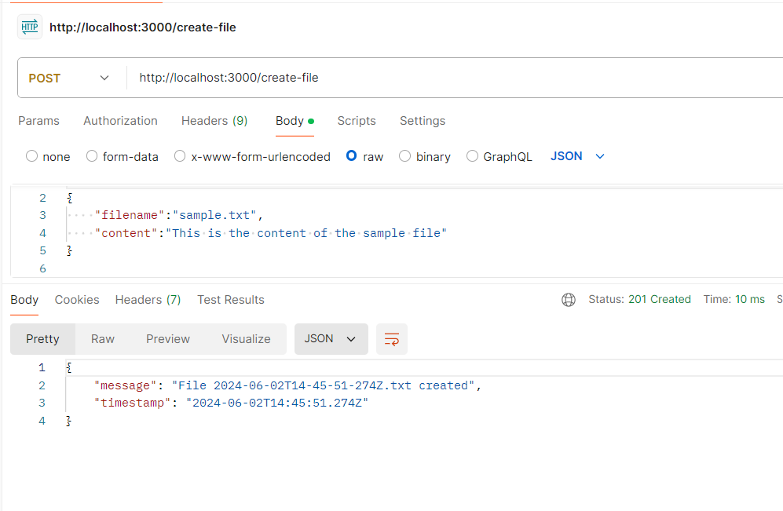
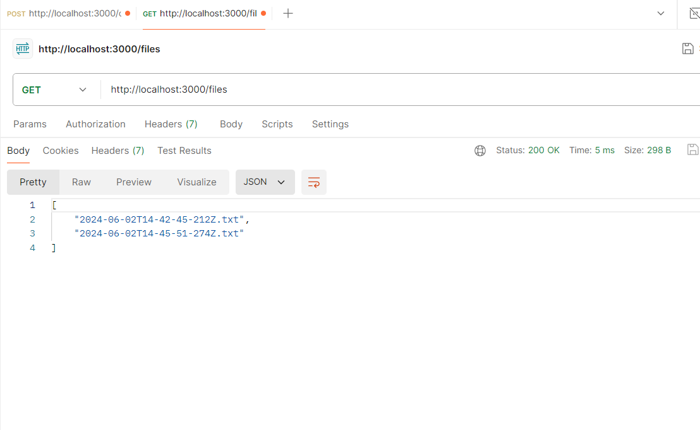

##         WEB DEVELOPER TASK

### NodeJS File System

### Task Details:

### 1.Write API endpoint which will create a text file in a particular folder
   - Content of the file should be the current timestamp

   - The filename should be current date-time.txt

### 2.Write API endpoint to retrieve all the text files in that particular folder

### How do I complete the task

- Create an Express Server

- Create an endpoint and use the necessary node js package for necessary functions
- Use tools such as `postman` to test my API

### Back-end:Node JS

## Sample Output Screenshots:

## npm run dev

Runs the app in the development mode.
Open http://localhost:3000 to view it in your browser.

The page will reload when you make changes.

You may also see any lint errors in the console.
